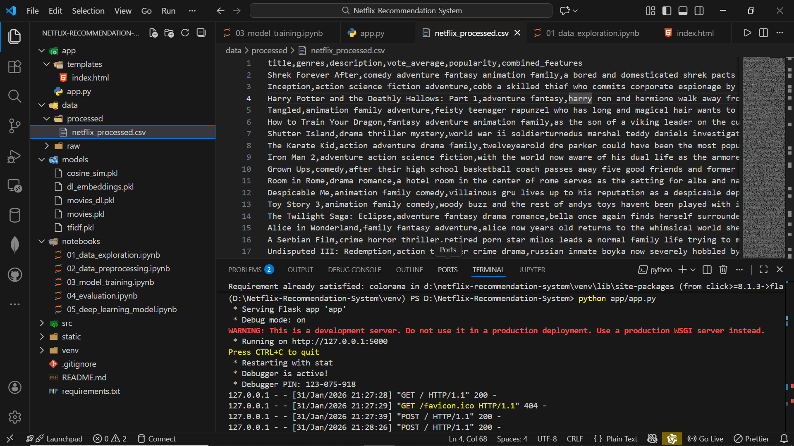
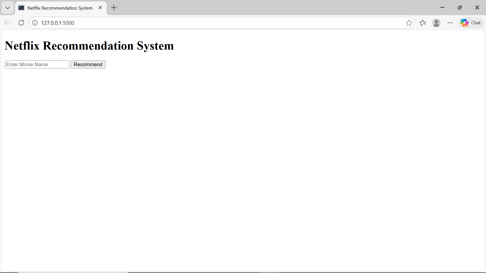
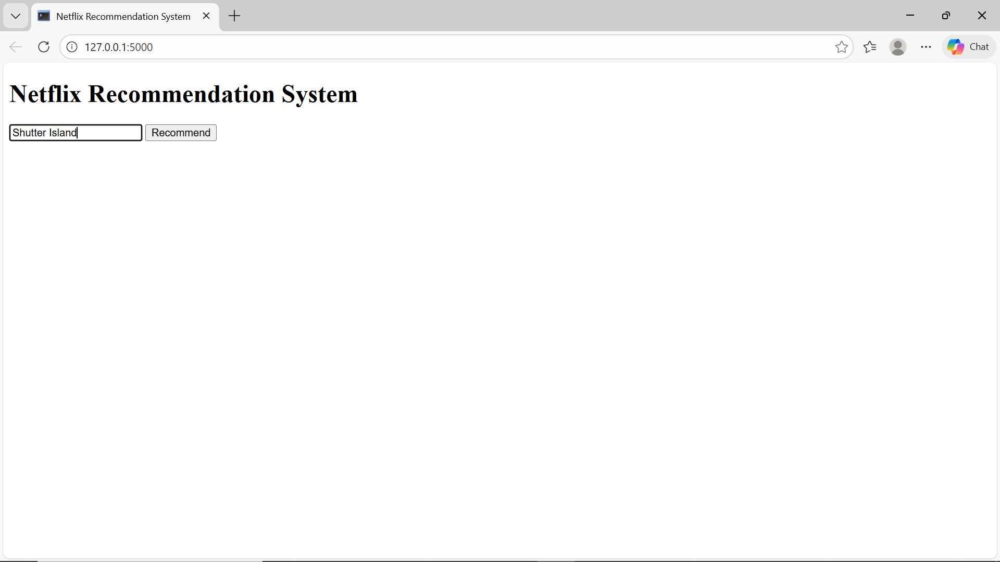
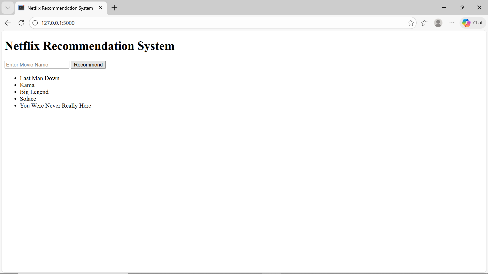

# 🎬 Netflix Recommendation System

A Content-Based Movie Recommendation System built using Python, Scikit-Learn, and Flask.

This project recommends movies similar to a given movie title using cosine similarity and TF-IDF vectorization.

---

## 📌 Project Overview

This system suggests movies based on content similarity.  
When a user enters a movie name, the system finds and displays similar movies using text-based feature comparison.

---

## 🚀 Features

- Movie title-based recommendation
- Content-based filtering
- Cosine similarity scoring
- TF-IDF vectorization
- Flask web application
- Simple and clean user interface

---

## 🛠️ Technologies Used

- Python
- Pandas
- NumPy
- Scikit-Learn
- Flask
- HTML

---

## 📂 Project Structure

```
Netflix-Recommendation-System/
│
├── app/
│   ├── templates/
│   │   └── index.html
│   └── app.py
│
├── data/
│   ├── raw/
│   └── processed/
│       └── netflix_processed.csv
│
├── models/
│   ├── movies.pkl
│   ├── cosine_sim.pkl
│   └── tfidf.pkl
│
├── notebooks/
│   ├── 01_data_exploration.ipynb
│   ├── 02_data_preprocessing.ipynb
│   ├── 03_model_training.ipynb
│   └── 04_evaluation.ipynb
│
├── requirements.txt
├── .gitignore
└── README.md
```

---

## ⚙️ Installation Guide

### 1️⃣ Clone the Repository

```bash
git clone https://github.com/your-username/Netflix-Recommendation-System.git
cd Netflix-Recommendation-System
```

### 2️⃣ Create Virtual Environment

```bash
python -m venv venv
```

Activate the environment:

**Windows**
```bash
venv\Scripts\activate
```

**Mac/Linux**
```bash
source venv/bin/activate
```

### 3️⃣ Install Dependencies

```bash
pip install -r requirements.txt
```

---

## ▶️ Run the Application

```bash
python app/app.py
```

Then open your browser and go to:

```
http://127.0.0.1:5000
```

---

## 🧠 How It Works

1. Data is cleaned and processed.
2. Text features (genres, metadata) are combined.
3. TF-IDF converts text to numerical vectors.
4. Cosine similarity calculates similarity scores.
5. Top similar movies are displayed to the user.

---

## 📊 Example

Input:
```
How to Train Your Dragon
```

Output:
- How to Train Your Dragon 2
- How to Train Your Dragon: The Hidden World
- Related franchise movies

---

## 📦 requirements.txt

```
Flask
pandas
numpy
scikit-learn
```

---

## 🚫 .gitignore

```
# Virtual Environment
venv/
env/

# Python cache
__pycache__/
*.pyc
*.pyo
*.pyd

# Jupyter Notebook checkpoints
.ipynb_checkpoints/

# VS Code settings
.vscode/

# Environment variables
.env

# OS files
.DS_Store
Thumbs.db

# Model files (if large)
*.pkl
```

---

## 📌 Future Improvements

- Add movie posters using TMDB API
- Add genre-based recommendation
- Improve UI design
- Deploy to cloud (Render / Railway / Heroku)
- Add autocomplete suggestions

---

## 👩‍💻 Author

**Azhagammai**  
B.Tech – Artificial Intelligence & Data Science  

---

## 📜 License

This project is developed for educational and learning purposes.


# Data Cleaning
- notebook
      - load the dataset




